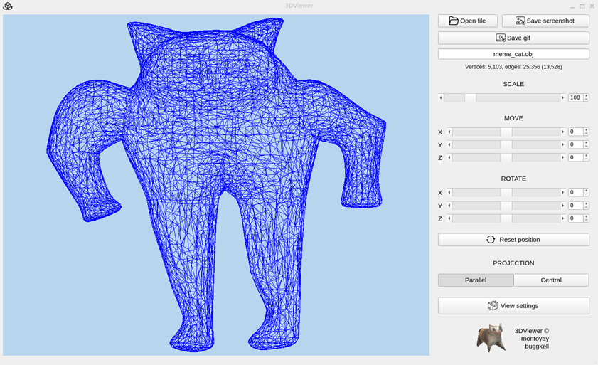

# 3DViewer v2.0




## Table of Contents
1. [Project Description](#project-description)
2. [Features](#features)
   - [Settings](#settings)
   - [Recording](#recording)
3. [Technical Requirements](#technical-requirements)
4. [Installation](#installation)
5. [Other functions](#other-functions)
6. [Documentation](#documentation)
7. [Authors](#authors)

## Project Description

**3DViewer v2.0** is an application for visualizing 3D wireframe models, developed in C++ following object-oriented programming principles. This project is an improved version of the previous application (3DViewer v1.0) and includes new features, support for large datasets, and flexible interface settings.

## Features

- Load 3D models in `.obj` format (vertices and face lists only).
- Perform the following affine transformations on the model:
  - Translate along the X, Y, Z axes.
  - Rotate around the X, Y, Z axes.
  - Scale the model.
- Graphical User Interface (GUI) that includes:
  - A button to select the model file and a field to display its name.
  - A visualization area for the wireframe model.
  - Control elements for translating, rotating, and scaling the model.
  - Information about the uploaded model (file name, number of vertices and faces).
- Support for models with vertex counts ranging from to 1,000,000 and more without noticeable delays (interface freeze does not exceed 0.5 seconds).
- Implementation based on the MVC architectural pattern.
- Use of three different design patterns (Facade, Builder, Singleton).

## Additional Features

### Settings
- Choose the type of projection (parallel or central).
- Configure the type (solid, dashed), color, and thickness of edges, as well as the shape, color, and size of vertices.
- Change the background color.
- Save user settings between program runs.

### Recording
- Save rendered model images in `.bmp` and `.jpeg` formats.
- Record model transformation animations as GIF files (10 FPS, 5 seconds).

## Technical Requirements

- Language standard: C++17.
- Build with `Makefile` containing standard targets (`all`, `install`, `uninstall`, `clean`, `tests`, etc.).
- Code follows Google Style guidelines.
- Supported GUI librarie - Qt.

## Installation

1. Clone the repository:
```bash
   git clone <repository-link>
   cd <repository-link>
```  

2. Install:
```bash
	cd src
	make install
```  

3. Run:
```bash
	make run
```  

4. Uninstall:
```bash
	make uninstall
```  

## Other functions

Also there's some other functions which You can use. You should be in the src folder.

1. Testing:
```bash
	make tests
```

2. Valgrind testing:
```bash
	make valgrind_test
```  

3. Make archive with program:
```bash
	make dist
```  

4. Make documentation with html and pdf versions (making new folder - documentation):
```bash
	make dvi
```  

5. Make gcov report with coverage report (making new folder - report):
```bash
	make gcov_report
```  

6. Make UML-diagram:
```bash
	make uml_diagram
```

## Documentation  

You can read documentation in html or pdf format which builded with Doxygen:  
- [HTML version](documentation_release/docs_html.lnk)
- [PDF version](documentation_release/latex/refman.pdf)

Also there's the UML-diagram which builded with hpp2puml:
- [PNG diagram](viewer_uml_diagram.png)
- [PUML version](viewer_uml_diagram.puml)


## Authors

School 21 students: 

- [Buggkell](https://t.me/a_a_sorokina)
- [Montoyay](https://t.me/tdutanton)

2025  
